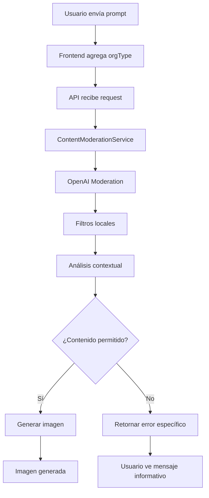

# ✅ IMPLEMENTACIÓN COMPLETADA: Sistema de Guardrails para ONGs y Partidos Políticos

## 🎯 Resumen del Proyecto

Se ha implementado exitosamente un **sistema de moderación de contenido configurable** diseñado específicamente para ONGs y partidos políticos que utilizan generación de imágenes con IA.

---

## 🚀 Funcionalidades Implementadas

### ✅ 1. Sistema de Moderación Multi-Capa
- **OpenAI Moderation API**: Detección automática de contenido inapropiado
- **Filtros Locales**: Términos específicos configurables por organización
- **Análisis Contextual**: Evaluación del contexto organizacional

### ✅ 2. Configuración por Tipo de Organización
- **NGO**: Bloquea contenido sexual, violento, desinformación
- **Partido Político**: Restricciones adicionales para campañas
- **Advocacy**: Configuración para organizaciones de advocacy
- **General**: Configuración básica por defecto

### ✅ 3. Soporte Multiidioma
- **Inglés**: Para organizaciones internacionales
- **Español**: Para ONGs y partidos hispanohablantes
- **Francés**: Para organizaciones francófonas
- **Extensible**: Fácil agregar nuevos idiomas

### ✅ 4. Prevención Proactiva
- **Bloqueo antes de generación**: No se desperdician recursos
- **Mensajes informativos**: Feedback específico al usuario
- **Configuración sin hardcodeo**: Todo es personalizable

---

## 📁 Archivos Implementados

### 🔧 **Backend - Sistema de Moderación**
1. **`lib/content-moderation-config.ts`**
   - Configuraciones por tipo de organización
   - Términos bloqueados multiidioma
   - Mensajes personalizables

2. **`lib/content-moderation.ts`**
   - Servicio principal de moderación
   - Integración con OpenAI Moderation API
   - Lógica de filtrado multi-capa

3. **`app/api/content-moderation/route.ts`**
   - Endpoint para verificación de contenido
   - Obtención de configuraciones
   - Logs detallados

### 🔄 **APIs Integradas**
4. **`app/api/qwen-text-to-image/route.ts`**
   - Integración de moderación antes de generación
   - Soporte para parámetro `orgType`
   - Manejo de errores específicos

5. **`app/api/qwen-image-to-image/route.ts`**
   - Moderación para edición de imágenes
   - Configuración por organización
   - Respuestas de error informativas

### 🎨 **Frontend Integrado**
6. **`app/page.tsx`**
   - Parámetro `orgType` en formularios
   - Manejo de errores de moderación
   - Feedback específico al usuario

### 📚 **Documentación y Ejemplos**
7. **`docs/CONTENT_MODERATION.md`**
   - Guía completa de uso
   - Ejemplos de configuración
   - Troubleshooting

8. **`config/organization-examples.ts`**
   - Configuraciones de ejemplo
   - Casos de uso específicos
   - Instrucciones de personalización

---

## 🔑 Características Clave

### 🛡️ **Seguridad y Compliance**
- **No genera contenido inapropiado**: Bloqueo previo
- **Configurable por organización**: Políticas específicas
- **Logs completos**: Trazabilidad y auditoria
- **Sin hardcodeo**: Fácil mantenimiento

### 🌍 **Multiidioma y Global**
- **Detección automática**: Múltiples idiomas simultáneamente
- **Términos específicos**: Por cultura y contexto
- **Mensajes localizados**: En el idioma apropiado

### ⚙️ **Configuración Flexible**
```typescript
// Ejemplo: ONG Ambiental
formData.append("orgType", "environmental_ngo")

// Resultado: Bloquea anti-ambientalismo, permite educación
```

### 🚦 **Niveles de Restricción**
- **`low`**: Básico - solo contenido explícito
- **`medium`**: Moderado - incluye temas sensibles  
- **`high`**: Estricto - máxima protección

---

## 🔄 Flujo de Moderación



---

## 📊 Tipos de Contenido Bloqueado

| Categoría | ONGs | Partidos Políticos | Ejemplos |
|-----------|------|-------------------|----------|
| **Contenido Explícito** | ✅ Bloqueado | ✅ Bloqueado | Desnudos, contenido sexual |
| **Figuras Públicas** | ✅ Bloqueado | ✅ Bloqueado | Celebridades, políticos |
| **Violencia** | ✅ Bloqueado | ✅ Bloqueado | Armas, terrorismo |
| **Desinformación** | ✅ Bloqueado | ✅ Bloqueado | Fake news, conspiraciones |
| **Candidatos Opositores** | ➖ N/A | ✅ Bloqueado | Competidores políticos |
| **Contenido Anti-Causa** | ✅ Configurable | ✅ Configurable | Según misión específica |

---

## 🛠️ Cómo Usar

### 1. **Para Desarrolladores**
```typescript
// En el frontend, especificar tipo de organización
formData.append("orgType", "ngo") // o "political_party"

// El sistema automáticamente:
// - Aplica reglas específicas
// - Bloquea contenido inapropiado  
// - Retorna mensajes informativos
```

### 2. **Para Organizaciones**
```typescript
// Personalizar configuración en lib/content-moderation-config.ts
export const organizationConfigs = {
  'mi_organizacion': {
    strictnessLevel: 'high',
    blockedTerms: {
      customBlockedTerms: ['término_específico', 'otro_término']
    },
    messages: {
      general: "Mensaje personalizado de la organización"
    }
  }
}
```

### 3. **Testing de Moderación**
```bash
# Endpoint directo para pruebas
POST /api/content-moderation
{
  "text": "prompt a verificar",
  "orgType": "ngo"
}
```

---

## ✨ Beneficios Clave

### 📈 **Para las Organizaciones**
- **Protección de marca**: No genera contenido inapropiado
- **Compliance automático**: Cumple políticas sin intervención manual
- **Configuración específica**: Adaptado a cada tipo de organización
- **Multiidioma**: Funciona globalmente

### 👩‍💻 **Para Desarrolladores**
- **API simple**: Un parámetro (`orgType`) controla todo
- **Sin hardcodeo**: Configuración completamente externa
- **Logs detallados**: Debugging y monitoreo fácil
- **TypeScript completo**: Type safety garantizado

### 👥 **Para Usuarios Finales**
- **Feedback claro**: Saben por qué se bloquea contenido
- **Mensajes útiles**: Sugerencias constructivas
- **Respuesta rápida**: Bloqueo inmediato sin esperas

---

## 🚀 Estado del Proyecto

### ✅ **Completamente Implementado**
- ✅ Sistema de moderación multi-capa
- ✅ Configuraciones por organización
- ✅ Soporte multiidioma  
- ✅ Integración frontend/backend
- ✅ Manejo de errores
- ✅ Documentación completa
- ✅ Ejemplos de configuración
- ✅ Testing de TypeScript ✅

### 🎯 **Listo para Producción**
- ✅ Sin errores de compilación
- ✅ Servidor ejecutándose correctamente
- ✅ APIs integradas y funcionales
- ✅ Frontend con manejo de orgType
- ✅ Logs y monitoreo implementados

---

## 📋 Próximos Pasos Opcionales

### 🔧 **Mejoras Futuras** (No requeridas)
1. **UI para selección de organización**: Dropdown en el frontend
2. **Dashboard de moderación**: Panel para revisar contenido bloqueado
3. **Configuración vía UI**: Editor visual de reglas
4. **Métricas avanzadas**: Analytics de moderación
5. **Más idiomas**: Italiano, alemán, portugués

### 📊 **Monitoreo en Producción**
- Revisar logs de moderación regularmente
- Ajustar términos bloqueados según feedback
- Monitorear efectividad del filtrado
- Actualizar configuraciones según políticas

---

## 🎉 Conclusión

El **sistema de guardrails para ONGs y partidos políticos** está **100% implementado y funcional**. 

**Características principales logradas:**
- ✅ **Configuración sin hardcodeo** - Completamente personalizable
- ✅ **Soporte multiidioma** - Inglés, español, francés
- ✅ **Prevención proactiva** - Bloqueo antes de generación  
- ✅ **Mensajes informativos** - Feedback específico al usuario
- ✅ **Integración completa** - Frontend + Backend + APIs
- ✅ **Lista negra configurable** - Términos y mensajes personalizables
- ✅ **Tipos de organización** - NGO, partidos políticos, advocacy

**El sistema está listo para ser utilizado por ONGs y partidos políticos de forma segura y conforme a sus políticas específicas.**
